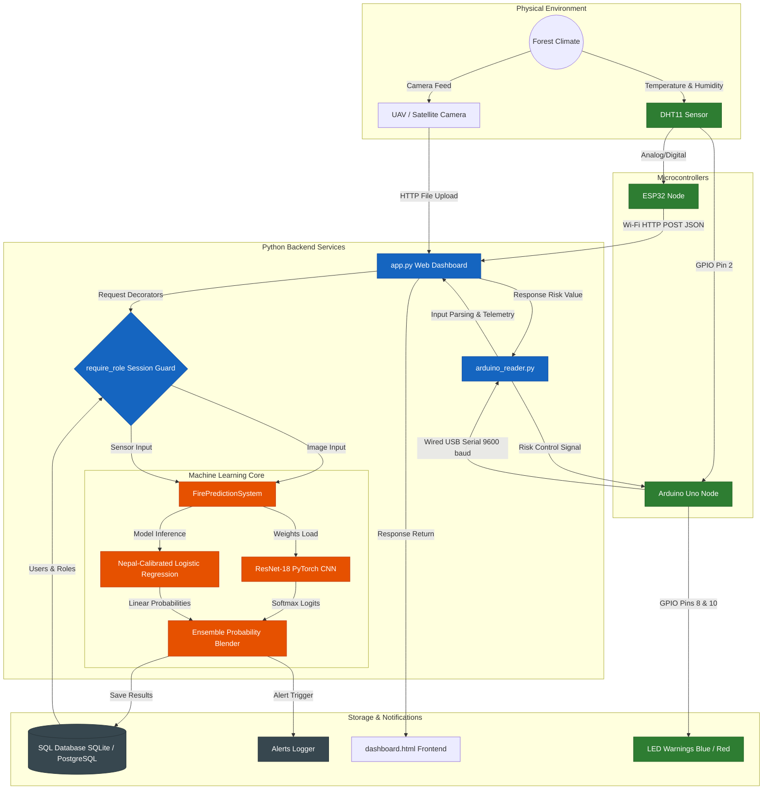

# 🌲 Forest Fire Detection System: Hybrid AI & IoT Early Warning System

**BCA Final Year Project | Tribhuvan University**

A production-ready, hybrid artificial intelligence and internet-of-things (IoT) system designed for real-time forest fire detection. The system integrates deep computer vision (CNN on aerial/satellite imagery) with physical environmental sensors (temperature and humidity) using a multi-modal ensemble model calibrated specifically for the climate of Nepal.

---

## 📌 Table of Contents
1. [Node Network & Module Connections](#-node-network--module-connections)
2. [Core Features](#-core-features)
3. [Technology Stack](#-technology-stack)
4. [Hardware Wiring Layout](#-hardware-wiring-layout)
5. [Setup & Quick Start](#-setup--quick-start)
6. [Detailed System Operations](#-detailed-system-operations)

---

## 🎨 Node Network & Module Connections

The system architecture employs an **Interface-Based Object-Oriented Design** following **SOLID principles** to ensure high extensibility. Below is the node network showing how files, hardware components, database tables, and logic routes interact:



For minute mathematical formulas, database table configurations, REST API response schemas, and OOP design pattern details, please refer to [system_implementation.md](file:///c:/Users/DELL/Music/fyp/forest-fire-detection/system_implementation.md).

---

## 📈 Core Features

*   **Multi-Modal Ensemble Model**: Merges visual information from cameras with atmospheric indices. If a visual feed is obstructed by dense smoke, environmental indicators can still trigger alerts.
*   **Nepal-Calibrated Predictor**: Combines 80% physical fire science parameters (climate dryness indicators) with 20% machine learning logistic estimation. This calibration addresses global database bias and models the real-world climate conditions of Nepal.
*   **Role-Based Access Control (RBAC)**: Supports user login sessions. Dashboard operations, alarms resolution, and settings are restricted to authenticated operators and administrators, while open telemetry channels remain available for microcontrollers.
*   **Dynamic UI Dashboard**: Implemented with dynamic Bootstrap 5 styles, responsive chart history, real-time gauges, visual upload components, and responsive alarm resolution cards.
*   **Microcontroller Serial Integration**: A background serial listening daemon logs incoming telemetry, performs inference, updates database storage, and feeds risk levels back to actuate physical indicator LEDs.

---

## 🛠️ Technology Stack

*   **Core Systems**: Python 3.11, C++ (microcontroller code)
*   **Deep Learning (Vision)**: `torch` (>=2.0.0), `torchvision` (>=0.15.0)
*   **Machine Learning (Sensors)**: `scikit-learn` (>=1.3.0), `joblib`
*   **Data Wrangling**: `pandas` (>=2.0.0), `numpy` (>=1.24.0)
*   **Web Framework & Server**: `flask` (>=3.0.0), `werkzeug` (>=3.0.0), `python-dotenv`
*   **Plots & Visualizations**: `matplotlib` (>=3.7.0), `seaborn` (>=0.12.0)
*   **Hardware Interface**: `pyserial` (>=3.5)
*   **Databases**: Local SQLite, PostgreSQL (`psycopg2-binary`)

---

## 🔌 Hardware Wiring Layout

```
            +---------------------------------+
            |         ARDUINO UNO / ESP32     |
            |                                 |
            |     5V ---[VCC DHT11]           |
            |    GND ---[GND DHT11]           |
            |  Pin 2 ---[DATA DHT11]          |
            |                                 |
            |  Pin 8 ---[Resistor 220Ω]---[+] | Blue LED (Normal / Low Risk)
            |            GND -------------[-] |
            |                                 |
            | Pin 10 ---[Resistor 220Ω]---[+] | Red LED (Alert / High Risk)
            |            GND -------------[-] |
            +---------------------------------+
```

---

## 🚀 Setup & Quick Start

### 1. Clone Project & Navigate
```bash
git clone https://github.com/PawanKhanal/forest-fire-detection.git
cd forest-fire-detection
```

### 2. Configure Virtual Environment
```bash
python -m venv .venv
# On Windows:
.venv\Scripts\activate
# On Linux/macOS:
source .venv/bin/activate
```

### 3. Install Packages
```bash
pip install -r requirements.txt
```

### 4. Setup Environment Parameters
Copy `.env.example` to `.env` and verify the settings:
```bash
cp .env.example .env
```
Ensure `ARDUINO_PORT` points to the correct system COM port (e.g. `COM3` on Windows, or `/dev/ttyUSB0` on Linux).

### 5. Download Data & Train Models
```bash
# Download datasets
python download_fire_dataset.py
python download_portuguese_fire_data.py

# Train PyTorch CNN & Sensor Models
python train_pytorch.py
python train_sensor_model.py
```

---

## 🏃 Detailed System Operations

### A. Run Web Dashboard
```bash
python app.py
# Server starts at http://localhost:5000
```
Login using the default administrator credentials:
*   **Username**: `admin`
*   **Password**: `admin`

### B. Run Serial Telemetry Listener
```bash
# Connect microcontroller to USB
python arduino_reader.py
```
This script reads DHT11 measurements, prints threat levels in the console, and writes risk factors back to actuate the Blue and Red LEDs on the hardware.
